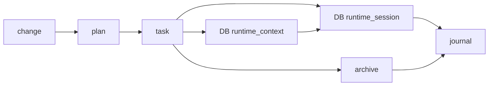

# Quick Start — Cowork Flow

> 1-page index for new readers. The rules live in `core/`; details in `reference/`.
>
> **Language**: English is the authoritative language for all spec documents. `AGENTS.md` and `workflow.md` retain Chinese summaries for Chinese-speaking developers, but English spec text takes precedence in case of conflict.

## Minimal workflow

```
changes → brainstorming → read spec → plan → tasks → implement → check → complete
```

1. **changes**: Capture the raw requirement in `.cowork-flow/changes/`.
2. **brainstorming**: Align on goal, scope, acceptance criteria, rejected options.
3. **read spec**: Read relevant contracts in `core/`.
4. **plan**: Write `.cowork-flow/plans/YYYY-MM-DD-<slug>.md` with verification commands.
5. **tasks**: Create tasks under `.cowork-flow/tasks/`, write `prd.md`, `implement.jsonl`, `check.jsonl`.
6. **implement**: Dispatch `cowork-implement` (fixed agent, leaf executor).
7. **check**: Dispatch `cowork-check` (fixed agent, leaf executor).
8. **complete**: Final verification, spec sync, archive, session recording, commit.

## When to read what

| You are... | Read these first |
| --- | --- |
| Setting up cowork-flow for the first time | This file + `core/lifecycle.md` |
| Implementing a feature | `core/lifecycle.md` + `core/dispatch.md` |
| Adding a host adapter | `core/dispatch.md` + `reference/adapters/capabilities.md` + `reference/adapters/adapter.schema.json` |
| Implementing a new pattern | `core/lifecycle.md` + `reference/patterns/index.md` |
| Configuring Party Mode | `reference/party-mode-v2-board.md` |
| Writing code (Python/JS) | `reference/guides/pre-implementation-checklist.md` + language-specific guidelines (`core/backend/index.md` for Python, `core/frontend/index.md` for JS) |

## Core protocol (must obey)

All rules below are mandatory. Violations break the fail-closed safety chain.

- **`core/entry.md`** — Entry classification: structured signal > legacy fallback > fail-closed.
- **`core/dispatch.md`** — Formal subagent dispatch via runtime context.
- **`core/lifecycle.md`** — Task lifecycle, fixed agents, state machine.
- **`core/state-templates.md`** — Workflow state text injected by hooks/plugins.

## Reference (details, read as needed)

- **`reference/patterns/`** — Pattern contracts (generic only).
- **`reference/adapters/`** — Host capability declarations and adapter schema.
- **`reference/party-mode-v2-board.md`** — Party Mode V2 board protocol.
- **`reference/guides/`** — Thinking guides (code reuse, cross-layer thinking, pre-implementation checklist).
- **`core/backend/`** — Backend development guidelines (Python, CLI, runtime scripts).
- **`core/frontend/`** — Frontend development guidelines (JS/TS, dashboard, web assets).

## Quick commands

```bash
# Task lifecycle
./.cowork-flow/run task create "<title>" --slug <slug>
./.cowork-flow/run task start <task-dir>
./.cowork-flow/run task review [task-dir]
./.cowork-flow/run task complete [task-dir]
./.cowork-flow/run task archive <task-name>
./.cowork-flow/run task next [task-dir]

# Subagent dispatch
./.cowork-flow/run subagent init
./.cowork-flow/run subagent spawn-family <parent-task>

# Dashboard
./.cowork-flow/run dashboard start
./.cowork-flow/run dashboard stop

# Migration
./.cowork-flow/run flow migrate --dry-run
./.cowork-flow/run flow migrate --status
```

## 5-minute loop

```bash
./.cowork-flow/run get-developer
./.cowork-flow/run task create "Document first workflow" --slug docs-first-workflow
./.cowork-flow/run task start .cowork-flow/tasks/docs-first-workflow
./.cowork-flow/run task next
./.cowork-flow/run task review
./.cowork-flow/run task complete
./.cowork-flow/run task archive docs-first-workflow
./.cowork-flow/run add-session --title "First workflow" --commit "-" --summary "Completed the first cowork-flow task."
```

The loop leaves task context, archive evidence, and a workspace journal entry.
`task next` is read-only; it reports the next safe command from the DB-backed
current session and the task lifecycle stage.

## Maintainer state map



## Task levels

| Level | Description | Flow |
| --- | --- | --- |
| L0 | No external behaviour change (docs, formatting, refactor) | `brainstorming` → `read spec` → `implement` → `check` → `complete` |
| L1 | Local behaviour change | Full 8-step flow |
| L2 | Cross-layer / significant change | Full flow + cross-layer check + readiness gate |

## Safety

- **Fail-closed**: `UNKNOWN` entry classification blocks workflow mutation.
- **Fixed agents are leaves**: They cannot dispatch other agents.
- **Runtime context is the source of truth**: Formal subagent identity comes from DB, not from prompt text.
- **Runtime session is current-state authority**: The active task and host bindings come from DB `runtime_session`; archived files are evidence, not live state.
