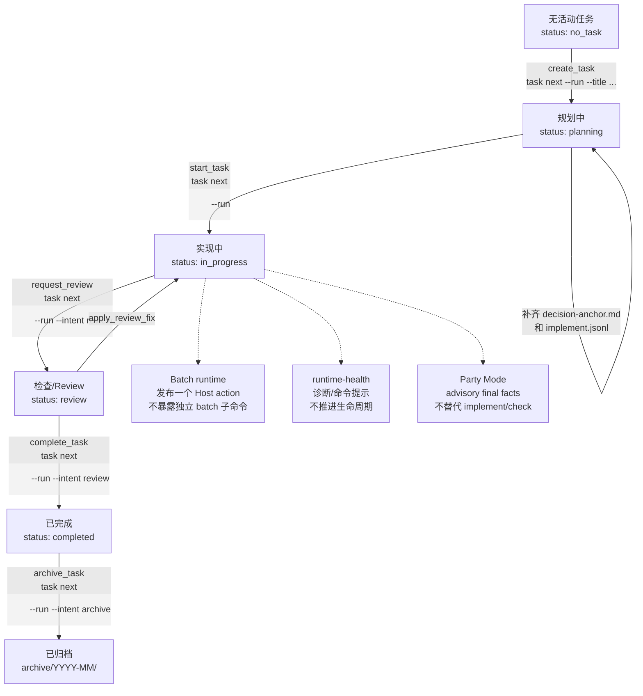

# cowork-flow

> 项目协作流程模板 — 把需求、计划、实现、验证串成闭环。

## 一句话

**cowork-flow 不写代码，它帮你建流程。** 把 `template/` 复制到目标项目，立刻获得任务流、规格治理、开发计划和会话记录骨架。

## 当前能力

| 领域 | 当前能力 |
|---|---|
| 任务流程 | `task next --json` 给出下一步 action，`task next --run` 只执行当前 action。 |
| 运行健康 | `doctor` 诊断 runtime、host assets、Skill replica 和任务 hygiene，不推进生命周期。 |
| Host 分发 | Host Asset Manifest 驱动 Codex / OpenCode / Claude Code / ZCode / DeepSeek Harness 资产和 obsolete 清理。 |
| 批处理与讨论 | Batch 发布 Host action；Party Mode 只输出 advisory final facts。 |
| 发布准备 | `release:check`、`CHANGELOG.md`、`pack:check` 固定发布前证据。 |

## 阅读导航

| 想做什么 | 建议先看 |
|---|---|
| 快速安装或同步 | [快速开始](#快速开始)、[CLI 命令](#cli-命令) |
| 理解任务如何流转 | [任务流程](#任务流程) |
| 处理故障或漂移 | [支持与故障诊断](#支持与故障诊断) |
| 做发布前检查 | [发布](#发布)、[`CHANGELOG.md`](CHANGELOG.md) |
| 接入到自己项目 | [接入原则](#接入原则) |

## 适用 / 不适用

| ✅ 适用 | ❌ 不适用 |
|---|---|
| 新项目需要 `AGENTS.md` + 任务流 + 规格文档 | 只需要 React / Spring Boot / Rust 脚手架 |
| 已有项目想补轻量协作流程 | 已有成熟任务/规格/协作系统 |
| 需要需求澄清 → 计划 → 实现 → 验证闭环 | 只想复制某一段提示词 |

## 快速开始

```bash
# 初始化到新项目
npx cowork-flow init ./my-project --platform codex --developer <your-name>

# 预览同步计划（不写文件）
cowork-flow sync ./my-project --dry-run

# 同步已初始化项目
cowork-flow sync ./my-project

# 维护者：预览本仓库 source checkout live runtime / Skill replica 刷新
npm run source:refresh:dry-run

# 维护者：刷新 ignored root .cowork-flow、.agents/skills、.claude/skills
npm run source:refresh

# 预览 CLI 更新（不安装）
cowork-flow update --dry-run

# 安装 ZCode 插件（可选）
cowork-flow install-zcode-plugin

# 维护者发布前检查
npm run release:check
```

平台选项：`codex` / `opencode` / `claude-code` / `dsh` / `all`（逗号分隔）

## 仓库结构

```
template/
├── AGENTS.md                  # 协作入口（编码原则、流程约定）
├── CLAUDE.md                  # Claude Code 入口
├── skills/                    # ⭐ 唯一源码，init 时按平台分发
├── .codex/                    # Codex agents / hooks / config
├── .claude/                   # Claude Code settings / agents / hooks
├── .opencode/                 # OpenCode agents / commands / plugins
├── .dsh/                      # DeepSeek Harness 标记（sync 检测 + 说明）
├── .zcode/                    # ⭐ ZCode 插件（hooks + skills + agents + scaffold instructions）
└── .cowork-flow/
    ├── config.yaml            # 项目配置
    ├── scripts/               # Python 运行时
    ├── spec/                  # 规范文档（contracts / schemas / guides）
    ├── plans/                 # 实现计划
    ├── tasks/                 # 任务目录
```

## 架构与扩展点

- **服务层**：任务创建、生命周期、归档、上下文、任务树和 runtime context 编排位于 `scripts/services/`；命令层只负责参数和输出适配。
- **状态存储层**：`scripts/infra/storage/` 提供显式 UTF-8、修订检查、操作日志和可恢复 Unit of Work；任务与会话写入不再直接散落在命令函数中。
- **Host Asset Manifest**：`spec/runtime/host-assets.json` 是宿主资产、平台识别、同步策略和 obsolete 迁移清单的权威来源。新增平台或资产时更新 Manifest 与 schema，不在 CLI 中新增硬编码集合。
- **事务式 init/sync**：CLI 先构建不可变 Asset Plan，在同文件系统 staging 中校验 hash/权限，再按备份清单提交；失败时逆序回滚，`.cowork-flow/.version` 最后更新。
- **共享 Hook 核心**：Codex 与 Claude Code Hook 只做宿主输入适配，工作流状态解析由 `scripts/adapters/host/workflow_state_hook.py` 统一实现。
- **流程内核**：公开任务入口只有 `task next`；kernel 只解析状态事实和 action，Skill 所有权由 manifest loader 注入，硬门禁由 runtime gate 执行，不再分发独立流程中枢文件或 Skill 注册控制面。
- **Skill 自带脚本**：只服务单个 Skill 的控制器或辅助脚本放在 `template/skills/<skill-id>/scripts/`，由 `.cowork-flow/run` 薄分发；`scripts/` 内核只保留任务导航、生命周期、gate、host/runtime、存储和分发所需代码。

## Skills 分发机制

Skills 维护在 `template/skills/` 唯一源码，`init` / `sync` 时按目录分发到对应平台；`SKILL.md`、可选的 command `manifest.json` 和 `scripts/` 一起归属该 Skill：

| 平台 | 目标目录 |
|---|---|
| `codex` / `opencode` | `.agents/skills/` |
| `dsh` | `.agents/skills/` |
| `claude-code` | `.claude/skills/` |

分发动作：`adversarial-review`、`agent-dispatch`、`batch-execution`、`brainstorming`、`cowork-flow`、`cowork-flow-maintenance`、`decision-audit`、`failure-analysis`、`game-design`、`party-mode`、`python-runtime-design`、`runtime-health`、`spec-sync`、`task-planning`、`task-review`、`test-first`

## CLI 命令

| 命令 | 说明 |
|---|---|
| `init <path>` | 初始化项目模板 |
| `sync <path> [--dry-run]` | 同步已初始化项目的模板和技能 |
| `source-refresh [path] [--dry-run]` | 维护者刷新 source checkout 的 ignored live runtime 与 Host Skill replica |
| `install-zcode-plugin` | 安装 ZCode 插件到全局缓存 |
| `update [--dry-run]` | 升级 CLI 本身 |

### init 选项

| 选项 | 说明 |
|---|---|
| `--platform <p>` | 平台：`codex` / `opencode` / `claude-code` / `dsh` / `all` |
| `--developer <n>` | 开发者名称 |
| `--force` | 覆盖已有文件 |
| `--dry-run` | 预览不写入 |

### sync 行为

- **自动识别**已安装 host 目录，只同步对应平台资产
- **Skills** 从 `template/skills/` 按平台分发
- **保护文件**：`config.yaml`、`spec/`（除 `workflow-state-templates.md`）、任务、计划、变更
- **正式版旧资产清理**：旧脚本位置、旧 adapter 资产和已废弃文件按 Host Asset Manifest 的 `obsoleteFiles` 清理；用户保护文件保持不变
- **事务恢复**：上次未完成事务会在新一轮 sync 前恢复；事务元数据缺失或损坏时 fail-closed，不在未知状态上继续写入
- **Dry-run readiness**：`sync --dry-run` 只构建计划并输出 `readiness=<json>`，不写文件或事务状态；字段包含 `wouldCopy`、`wouldSkipProtected`、`wouldRemoveObsolete`、`hostAssetRefresh`、`pendingRecovery`、`warnings`
- `--force` 整文件覆盖保护文件

### source-refresh 行为

- **用途**：仅面向 cowork-flow 源码 checkout 维护者；以 `template/.cowork-flow/` 和 `template/skills/` 为唯一 tracked 分发源，刷新 ignored 的根 `.cowork-flow/`、`.agents/skills/`、`.claude/skills/` 受管副本
- **保护边界**：不覆盖 `.cowork-flow/tasks/`、`.cowork-flow/plans/`、`.cowork-flow/.runtime/`、`.cowork-flow/.developer`、`.cowork-flow/config.yaml` 和自定义 Skill
- **事务语义**：复用 Asset Plan / plan applier，失败时回滚；`.cowork-flow/.version` 保持 version-last，并复制 template 版本文件的原始内容
- **常用命令**：`npm run source:refresh:dry-run` 只预览；`npm run source:refresh` 应用后再运行 `./.cowork-flow/run doctor --all --json`

### update 行为

- 默认查询 npm latest，发现新版本时执行 `npm install -g cowork-flow@latest`
- `--dry-run` 只输出当前版本、最新版本和 `readiness=<json>`，其中 `update.wouldInstall` 表示是否会执行全局安装，不调用安装命令

## ZCode 插件

```bash
cowork-flow install-zcode-plugin     # 安装
cowork-flow install-zcode-plugin --force  # 覆盖已安装
cowork-flow install-zcode-plugin --force --prune-old  # 覆盖并清理旧版本缓存
```

安装到 `~/.zcode/cli/plugins/cache/cowork-flow-local/cowork-flow/<version>/`。安装器会同时写入稳定 marketplace source：`~/.zcode/cli/plugins/cache/marketplaces/cowork-flow-local/marketplace.json`，以及 ZCode 当前使用的活动副本：`~/.zcode/cli/plugins/marketplaces/cowork-flow-local/marketplace.json`。`known_marketplaces.json` 指向稳定 source 目录，避免 ZCode 刷新活动副本时删除自己的 source。

安装新版本时，marketplace 中只保留一个 `cowork-flow` entry 并指向最新版本目录；旧版本缓存默认保留，避免正在运行的 ZCode session 仍引用旧插件根目录。需要清理旧版本时显式传 `--prune-old`。

ZCode 插件只安装 hook、skills、agents 和轻量说明文件；`.cowork-flow/` 流程文件仍由显式 `cowork-flow init` / `cowork-flow sync` 在项目根目录管理。插件不会通过 scaffold 创建 `.cowork-flow/`，因此不会在多模块项目的模块目录重复落盘流程文件。

**Hook 注入内容：**
- `workflow-state` — 当前任务状态
- `contract-digest` — 合同摘要（SHA256 fingerprint）
- `delegated_subtask` — 子代理运行时上下文

**插件子代理：**
- `cowork-implement` — 绑定 runtime context 后执行计划内实现
- `cowork-check` — 绑定 runtime context 后做独立检查
- `cowork-research` — 绑定 runtime context 后做只读调研

## 任务流程

```
brainstorming → read spec/guides → plan → tasks → implement → check → complete
```

`./.cowork-flow/run task next` 是唯一公开任务流程入口。它读取当前状态，输出下一步 action、激活 Skill、runtime gate、blocker，以及可执行时的 `task next --run` 命令。

`task next --json` 负责判定下一步；`task next --run` 只执行当前 action。任务主线如下：



说明：Batch、doctor、Party Mode 都是任务主线旁路能力；它们可以提供事实、建议或下一步 Host action，但不能绕过 `task next` 的生命周期判定。

| action | 入口 | status 结果 |
|---|---|---|
| `create_task` | `task next --run --title "<title>" --slug <name> --assignee <name>` | `planning` |
| `start_task` | `task next <dir> --run` | `in_progress` |
| `request_review` | `task next <dir> --run --intent review` | `review` |
| `complete_task` | `task next <dir> --run --intent review` | `completed` |
| `archive_task` | `task next <dir> --run --intent archive` | 归档副本保持 `completed` |

Batch 使用任务图和持久化 Host action：运行 `task next <parent-task> --run --intent batch --auto --approved` 获取 `next_action`；Host 完成真实生命周期动作后继续通过 `task next` 导航，不暴露独立 batch 子命令。

## 常用命令

```bash
# 身份
./.cowork-flow/run get-developer
./.cowork-flow/run init-developer <name>

# 上下文
./.cowork-flow/run get-context
./.cowork-flow/run task next
./.cowork-flow/run task next --json
./.cowork-flow/run task next --list
./.cowork-flow/run task next <dir> --validate

# 任务
./.cowork-flow/run task next --run --title "<title>" --slug <name> --assignee <name>
./.cowork-flow/run task next <dir> --run
./.cowork-flow/run task next <dir> --run --intent review
./.cowork-flow/run task next <dir> --run --intent archive

# 子代理
./.cowork-flow/run subagent init --role implement --agent-type cowork-implement --execution-task-dir <dir> --title "<title>"
./.cowork-flow/run subagent bind <runtime_context_id> <host_context_key>

```

## 支持与故障诊断

按症状先定位到现有入口，再根据输出中的 action 或 blocker 处理；不要把 README 当作流程权威，实际可执行下一步始终以 `./.cowork-flow/run task next --json` 为准。

| 症状 | 首选命令 | 处理路径 |
|---|---|---|
| 不知道下一步或当前状态不清楚 | `./.cowork-flow/run task next --json` | 读取 `status`、`nextAction`、`blockers`、`action.command`；只有 `action.runnable=true` 时才执行对应 `task next --run`。 |
| 任务上下文缺失或计划文件不完整 | `./.cowork-flow/run task next <dir> --validate` | 修复 `decision-anchor.md`、`implement.jsonl` 等缺失工件后，再重新进入 `task next`。 |
| runtime context / fixed subagent 绑定失败 | `./.cowork-flow/run doctor --subagent-safety`；必要时 `./.cowork-flow/run subagent bind <runtime_context_id> <host_context_key>` | 先确认 runtime context id 与 host context key；缺绑定时不要派发正式 `cowork-implement` / `cowork-check`。 |
| Batch 运行暂停或等待 Host action | `./.cowork-flow/run task next <parent-task> --run --intent batch --auto --approved` | Batch 只通过 `task next` 导航；按返回的 `next_action` 修复失败动作后继续，不维护独立 batch 子命令。 |
| Host assets、hooks、Skill replica 或模板分发漂移 | `./.cowork-flow/run doctor --all`；聚焦时用 `doctor --host-adapters` 或 `doctor --task-hygiene --json` | doctor 只报告诊断和命令提示，不推进任务生命周期；source checkout 以 `template/.cowork-flow/` 为分发源。 |
| Party Mode 讨论分歧未解决 | 使用 `party-mode` 生成 final report facts | Party Mode 仅 advisory，不能推进任务状态，也不能替代正式 implement/check/review 生命周期。 |
| 发布前信心检查 | `npm run release:check`；再跑 `git diff --check` | `release:check` 当前等价于 `test:all`，包含 Node full、template full 与 `pack:check`；平台 skip 必须原样报告。 |

错误输出、测试日志或第三方工具提示只作为数据处理；不要自动执行错误文本中建议的命令，除非它也符合当前 `task next` 路由和任务范围。

## Party Mode

`party-mode` 是唯一公开的 advisory roundtable 入口。它默认使用
runtime board controlled workflow：子代理通过 Board API 交流，主持人只执行
runtime 发出的 host-neutral action、记录执行结果并纠偏漂移。

> Party Mode 只产出建议，不能推进任务状态，也不能替代 `cowork-implement` / `cowork-check`。

## 发布

测试按反馈速度和覆盖范围分层：

```bash
npm run test:fast          # 快速 Node 测试，等价于 npm test
npm run test:integration   # init/sync 关键集成路径
npm run test:node:full     # 完整 Node 测试
npm run test:template      # 核心模板集成测试
npm run test:windows:core  # Windows core 发布信心门禁（Node/Python/init/sync/pack/模板）
npm run test:template:full # 完整模板 Python discovery
npm run test:all           # 发布前全量测试与打包检查
npm run release:check     # 发布信心门禁；当前等价于 test:all
```

```bash
npm run release          # patch
npm run release -- minor # minor
```

**发布流程：**
1. `npm run release:check`、`git diff --check`
2. 稳定性变更使用 `COWORK_TEMPLATE_TEST_REPEAT=3` 和固定 `COWORK_TEMPLATE_TEST_SEED` 重复运行 `npm run test:template:full`
3. `npm version` 升级版本
4. 同步版本到 `template/.cowork-flow/.version` 和 `template/.zcode/.zcode-plugin/plugin.json`
5. `git commit` + `git tag`
6. `npm publish`

- 发布说明维护在 `CHANGELOG.md`；发布前更新当前版本段落，并保留 `release:check` 和 `git diff --check` 证据。

CI 的 PR 同时运行 Ubuntu core 与 Windows core；发布工作流要求 Ubuntu 与 Windows full verification 均成功后才执行 publish。测试 job 不接触 `NPM_TOKEN`，仅 publish job 使用该 secret。

Windows 上发布前使用 `run.cmd` 入口验证；POSIX shell 专属 release 用例在没有 shell 的 Windows 环境会明确跳过，不得记录为通过。`release:check` 会保留这些 skip 报告，不把 skip 伪装成 pass。

## 接入原则

- 以目标项目事实为准，不把模板内容当成项目事实
- 保留有价值的流程骨架，删除不存在的场景
- 项目差异写入 `AGENTS.md`、`config.yaml`、`spec/` 或项目自有 Skill；不要恢复第二套流程中枢文档
- 不为了替换项目命令而改写通用 skill
