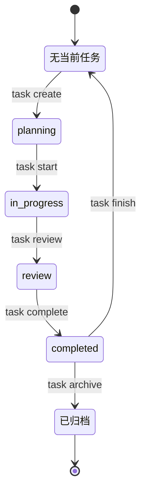

# cowork-flow

cowork-flow 是一个用于新项目初始化协作流程的模板仓库。它把项目说明、任务流转、规格治理、开发计划和会话记录放在一套可复制的目录结构里，帮助团队在项目早期就建立清晰的工作闭环。

这个仓库本身不绑定具体技术栈，也不提供业务代码脚手架。它提供的是协作与治理基础设施：你可以把 `template/` 复制到目标项目中，再按目标项目的真实情况补充技术栈、质量门禁、目录规范和提交策略。

## 适用场景

- 新项目需要建立 `AGENTS.md`、任务流、规格文档和开发记录。
- 已有项目希望补上一套轻量的协作流程，但不想引入完整工程脚手架。
- 团队希望把需求澄清、规格变更、实现计划、验证和会话记录串成闭环。

## 不适用场景

- 只需要一个语言或框架脚手架，例如 React、Spring Boot、Rust crate 模板。
- 项目已经有成熟且完整的任务、规格和协作系统，并且不希望引入新的目录约定。
- 只想复制某一段提示词，而不需要维护项目级流程文件。

## 仓库结构

```text
.
├── README.md
└── template/
    ├── AGENTS.md
    ├── CLAUDE.md
    ├── .codex/
    │   └── agents/
    ├── .claude/
    │   ├── settings.json
    │   ├── agents/
    │   ├── skills/
    │   ├── commands/
    │   └── hooks/
    ├── .opencode/
    │   ├── agents/
    │   ├── commands/
    │   └── plugins/
    ├── .agents/
    │   └── skills/
    └── .cowork-flow/
        ├── config.yaml
        ├── workflow.md
        ├── scripts/
        ├── spec/
        │   ├── contracts/
        │   ├── runtime/
        │   ├── schemas/
        │   ├── backend/
        │   ├── frontend/
        │   └── guides/
        ├── changes/
        ├── plans/
        ├── tasks/
        └── workspace/
```

## 模板内容

`template/AGENTS.md`
项目级协作入口，包含编码前思考、简单优先、外科手术式改动、验证优先等基础原则。接入项目后，应把项目名称、技术栈、运行命令、测试命令和提交策略补齐。

`template/.agents/skills/`
本地技能入口，覆盖 start、before-dev、brainstorming、party-mode、party-mode-v2、writing-plans、check、finish-work、continue、meta、python-design、update-spec 和 break-loop 等协作动作。这里的 skill 应保持通用，不承载某个业务项目的一次性细节。

`party-mode` 是用户手动调用的 advisory roundtable。它通过当前 Host Adapter 协调真实子代理讨论，而不是模拟人设；默认 `max_agents=3`、`max_rounds=5`，配置优先级为本次调用、task/change、本地配置、skill 默认值。Party Mode 只产出建议、证据、分歧和验收信号，不能推进任务状态，也不能替代 `cowork-implement` 或 `cowork-check`。

`party-mode-v2` 是 runtime board controlled advisory workflow。Python runtime 管理看板、当前轮视图、schema 校验、轮次上限和最终报告；子代理通过 board API 交流，主持人只监控和纠偏，不转发或综合观点。

`template/.codex/agents/`
固定角色 agent 定义，包含 `cowork-research`、`cowork-implement` 和 `cowork-check`，以及对 Codex 默认 `worker`、`default`、`explorer` 的项目级防漂移约束。主会话负责计划与收口，并通过 host adapter 派发固定 agent；正式派发必须先创建 runtime context，再把 `cowork_runtime_context_id` 和 `cowork_host_context_key` 传给子代理。

`template/.codex/config.toml`、`template/.codex/hooks.json`、`template/.codex/hooks/`
Codex 项目级配置与每轮上下文注入入口。hook 会先解析 runtime context，再读取当前 session task、`.cowork-flow/spec/contracts/workflow-state-templates.md` 中的 `workflow-state` 片段和 `codex.dispatch_mode`，把流程状态注入到当前轮对话。注入的 `codex-dispatch-mode` 只是主会话调度提示，不代表当前线程身份。

`template/CLAUDE.md`、`template/.claude/settings.json`、`template/.claude/agents/`、`template/.claude/skills/`、`template/.claude/commands/`、`template/.claude/hooks/`
Claude Code 项目级记忆、hook、固定 agent、skills 和 slash command。`CLAUDE.md` 显式导入 `AGENTS.md`。`.claude/settings.json` 注册 `UserPromptSubmit` 和 `SessionStart` hook，注入当前 workflow state 与 contract digest。固定 agent 通过 `.cowork-flow/run subagent init` 生成 runtime context，并在 prompt、env 或 metadata transport 中传递 `cowork_runtime_context_id`；hook 绑定成功后才进入叶子执行，绑定失败则 fail closed，避免被项目 bootstrap 或无任务首屏上下文拉偏。Claude Code 不自动加载 `.agents/skills/`，所以项目技能要放进 `.claude/skills/`。

`template/.opencode/agents/`、`template/.opencode/commands/`、`template/.opencode/plugins/`
OpenCode 项目级固定 agent、slash command 和系统上下文注入插件。插件会读取 `.cowork-flow/spec/runtime/contract-registry.json`，注入短 contract digest。

`template/.cowork-flow/`
工作流目录，包含流程说明、任务状态、开发者工作区、项目规范、行为变更规格、实现计划和辅助脚本。`.cowork-flow/config.yaml` 只承载真实接线的 session/journal, Codex hint, and task lifecycle hook settings。

`template/.cowork-flow/spec/`
项目规范目录。`contracts/` 存人读 workflow/host/agent 合同，`runtime/` 存运行时读取的规则和 contract registry，`schemas/` 存 JSON Schema，`backend/`、`frontend/`、`guides/` 存工程规范和思考指引。接入时应按项目事实保留、改写或删除对应规范。

`template/.cowork-flow/changes/`
由 `change.py` 管理 proposal、design、behavior specs 和归档，不维护实现 checklist。

`template/.cowork-flow/plans/`
保存可执行步骤、验证方式和执行状态。

## 快速开始

使用 CLI 把模板内容安装到目标项目根目录：

```bash
npx cowork-flow init ./my-project --platform codex
```

`init` 会显式要求平台和开发者身份。平台可选 `codex`、`opencode`、`claude-code`、`all`。交互式终端会提示输入；脚本或 CI 请传入：

```bash
npx cowork-flow init ./my-project --platform codex --developer <your-name>
```

也可以先全局安装：

```bash
npm install -g cowork-flow
cowork-flow init ./my-project --platform codex --developer <your-name>
```

初始化后优先完成这些配置：

1. 更新 `AGENTS.md` 中的项目名称、技术栈、命令和提交策略。
2. 按需调整 `.cowork-flow/config.yaml` 中的 session/journal, Codex hint, and task lifecycle hook settings。
3. 更新 `.cowork-flow/workflow.md` 中与项目流程不一致的门禁、分级和完成定义。
4. 按项目实际情况调整 `.cowork-flow/spec/`，删除不存在的 frontend、backend 或行为变更场景。
5. 按团队实践使用 `.cowork-flow/changes/` 管理规格变更，使用 `.cowork-flow/plans/` 管理实现计划和验证状态。

## CLI 使用

查看命令：

```bash
npx cowork-flow --help
```

初始化到新项目：

```bash
cowork-flow init ./my-project --platform codex
```

`init` 会直接复制模板中的通用 `.cowork-flow/`，并按 `--platform` 只复制对应 host 资产：`codex` 复制 `.codex/`、`.agents/skills/` 与 `.cowork-flow/adapters/codex/`，`opencode` 复制 `.opencode/`、`.agents/skills/` 与 `.cowork-flow/adapters/opencode/`，`claude-code` 复制 `CLAUDE.md`、`.claude/`（含 `.claude/settings.json`、`.claude/hooks/`、`.claude/skills/`）与 `.cowork-flow/adapters/claude-code/`，不复制 `.agents/skills/`。`all` 或 `--platform codex,opencode,claude-code` 同时复制三者和 `.agents/skills/`。它还会初始化 `.cowork-flow/.developer` 与 `.cowork-flow/workspace/<developer>/`。交互式终端会先显示 checkbox 多选界面选择平台，再提示开发者名称；非交互式环境必须传入 `--platform <codex|opencode|claude-code|all>` 与 `--developer <name>`。`init` 不会复制额外技能包。

初始化到当前项目：

```bash
cowork-flow init . --platform opencode
```

默认不会覆盖已有文件。需要预览时使用：

```bash
cowork-flow init ./my-project --platform all --dry-run
```

需要明确覆盖已有文件时使用：

```bash
cowork-flow init ./my-project --platform codex --force --developer <your-name>
```

`--force` 不会静默覆盖既有 `.cowork-flow/.developer`；如需重设身份，请先显式处理旧身份文件。

升级 CLI 本身：

```bash
cowork-flow update
```

同步已初始化项目中的模板脚本和本地技能：

```bash
cowork-flow sync .
cowork-flow sync . --dry-run
```

`sync` 会自动识别目标项目已安装的 host 目录：只有 `.codex/` 时只同步 Codex 资产，只有 `.opencode/` 时只同步 OpenCode 资产，两者都有时同步两者；对应 `.cowork-flow/adapters/<host>/` 也按识别出的平台同步。检测到 Codex 或 OpenCode 时会刷新 `.agents/skills/`；Claude Code-only 项目只刷新 `.claude/settings.json`、`.claude/hooks/`、`.claude/skills/`，不会创建 `.agents/skills/`。通用部分默认刷新 `.cowork-flow/scripts/`、`.cowork-flow/spec/contracts/workflow-state-templates.md`，以及 `AGENTS.md` 和 `CLAUDE.md` 中的 `<!-- COWORK-FLOW:START --> ... <!-- COWORK-FLOW:END -->` 托管块，保留托管块之外的项目自定义内容。`.cowork-flow/config.yaml`、`.cowork-flow/workflow.md`、除 `workflow-state-templates.md` 外的 `.cowork-flow/spec/`、任务、计划、变更和 workspace 记录默认受保护。只有明确传入 `--force` 时才整文件覆盖保护文件。

## 常用入口

模板内置统一入口来运行 Python 工作流脚本：

- macOS / Linux / Git Bash / WSL：`./.cowork-flow/run`
- Windows cmd / PowerShell：`.\.cowork-flow\run.cmd`

入口会按 `COWORK_FLOW_PYTHON`、`PYTHON`、`python3`、`python`、`py -3`
的顺序查找 Python 3.8+ 解释器，避免不同环境中 `python` / `python3`
命令不一致的问题。

下面示例使用 macOS / Linux 写法；Windows 原生命令行中把
`./.cowork-flow/run` 替换为 `.\.cowork-flow\run.cmd`。

当前主流程以 `.cowork-flow/workflow.md` 为准。默认路径是：

```text
changes -> brainstorming -> read spec -> plan -> tasks -> implement -> check -> complete
```

L0 文档、格式、小范围重构或测试补充可简化为
`brainstorming -> read spec -> implement -> check -> complete`；L1/L2 在完成后继续
`archive -> add session`。

初始化或查看开发者身份：

```bash
./.cowork-flow/run get-developer
./.cowork-flow/run init-developer <developer-name>
```

查看当前上下文：

```bash
./.cowork-flow/run get-context
./.cowork-flow/run task list
./.cowork-flow/run task next
```

创建并验证行为变更：

```bash
./.cowork-flow/run change create <slug>
./.cowork-flow/run change validate <slug>
```

创建并启动任务：

```bash
./.cowork-flow/run task create "<title>" --slug <task-name>
./.cowork-flow/run task next
./.cowork-flow/run task start <task-dir>
```

`task next` 只读，不推进状态。它根据当前会话任务和 `task.json.status`
报告当前任务、阻塞项和下一条安全命令；主会话在启动工作、派发固定代理、
进入检查、归档或记录 session 前都应先看它。

L2 任务的 readiness gate 会在 `task start` 前阻塞缺失的 proposal/spec/design、
计划、任务链接、边界、假设、验收标准或 verification commands；同一 blocker
会出现在 `task next` 输出中。

任务状态流转：



任务状态由阶段命令推进，`task next` 只读取状态：

| 阶段 | 命令 | `task.json.status` |
| --- | --- | --- |
| 创建/计划 | `task create` | `planning` |
| 开始执行 | `task start <task-dir>` | `in_progress` |
| 进入检查 | `task review [task-dir]` | `review` |
| 检查完成 | `task complete [task-dir]` | `completed` |
| 归档任务 | `task archive <task-name>` | 归档副本保持 `completed` |
| 清会话指针 | `task finish` | 不改变状态 |

执行 plan 时使用固定 cowork agents：

主会话负责创建/启动任务、维护计划与收口验证；实现和检查默认通过当前 Host Adapter
派发给固定角色 agent。固定 agent 是叶子执行者，不能再派发其他 agent，也不能替代主会话完成归档、记录 session 或提交。

```text
./.cowork-flow/run subagent init --role implement --agent-type cowork-implement --execution-task-dir <task-dir> --title "<title>"
```

将命令返回的 prompt transport 放入子代理 prompt：

```text
cowork_runtime_context_id: <runtime_context_id>
cowork_host_context_key: <host_context_key>
```

子代理首步执行 `./.cowork-flow/run subagent bind <runtime_context_id> <host_context_key>`；主会话验收前必须确认 runtime context 中 `status=bound` 且 `bound_context_key` 匹配。默认角色为 `cowork-research`、`cowork-implement`、`cowork-check`，任务上下文来自已绑定 runtime context，而不是 prompt 形状。

Host hook/plugin 启用后，每轮会自动注入 workflow state，其中包含入口分类、当前任务、状态来源和下一步流程提示。状态文本来自 `.cowork-flow/spec/contracts/workflow-state-templates.md`；`workflow.md` 只描述流程，不内联状态片段。hook 不替代主会话验收；它只负责把 task 状态和 workflow gate 放进上下文。

记录 session：

```bash
./.cowork-flow/run get-context --mode record
./.cowork-flow/run add-session \
  --title "<session-title>" \
  --commit "<commit-or-handoff-ref>" \
  --summary "<summary>"
```

## 接入原则

- 以目标项目事实为准，不把模板内容当成项目事实。
- 保留有价值的流程骨架，删除目标项目不存在的场景。
- 项目差异写入 `AGENTS.md`、`.cowork-flow/workflow.md`、`.cowork-flow/config.yaml` 和 `.cowork-flow/spec/`。
- 不为了替换项目命令或一次性任务而改写通用 skill。
- README 只说明项目定位和使用方式；具体协作规则应沉淀在模板内对应文件中。

## 维护建议

更新模板时，优先确认这几件事：

- `template/` 中的目录结构和 README 描述一致。
- 新增流程规则有明确承载位置，不散落在多个文件里互相冲突。
- 脚本入口和文档中的命令保持一致。
- 通用 skill 保持可复用，项目专用规则不混入 starter 模板。
- 示例命令尽量保持最小可用，避免把模板写成某个具体项目的实现方案。

## 发布流程

发布前先确认本地或 CI 具备 npm 发布凭据，例如已执行 `npm login`，或在 CI 中配置了 `NPM_TOKEN`。

推荐使用 release 脚本发布：

```bash
npm run release
```

默认会升级 patch 版本，执行顺序是：

1. `npm run test:all`
2. `npm version patch --no-git-tag-version`
3. 将 `package.json` 中的新版本同步写入 `template/.cowork-flow/.version`
4. `git add package.json package-lock.json template/.cowork-flow/.version`
5. `git commit -m "chore(release): <version>"`
6. `git tag v<version>`
7. `npm publish`

需要发布其他版本类型时，把 npm 支持的版本类型传给脚本：

```bash
npm run release -- minor
npm run release -- major
npm run release -- prerelease
```

脚本会在任一步骤失败时停止后续发布动作。CI 仍会运行 Node CLI 测试、npm pack 内容检查和现有 Python 模板测试；GitHub Actions 的 `Publish npm Package` workflow 仍需要在仓库 secrets 中配置 `NPM_TOKEN`。

可选集成测试位于 `tests/integration/`，依赖 Python 环境中的 `pytest`。它不属于默认发布链；需要验证时运行：

```bash
npm run test:integration
```
